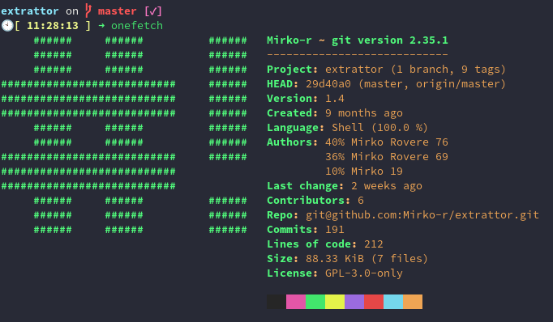

# Description


A simple bash wrapper to manage one or more archives from the terminal

      

# Installation

## Arch Linux and derivatives (AUR)

### Stable
package: [extrattor](https://aur.archlinux.org/packages/extrattor)<br>

Use an [AUR helper](https://wiki.archlinux.org/title/AUR_helpers) or

```bash
git clone https://aur.archlinux.org/extrattor.git
makepkg -si
```

### Unstable
package: [extrattor-git](https://aur.archlinux.org/packages/extrattor-git)<br>

Use an [AUR helper](https://wiki.archlinux.org/title/AUR_helpers) or

```bash
git clone https://aur.archlinux.org/extrattor-git.git
makepkg -si
```

## Fedora (35)

### Only stable version is provided

Download from [Release page](https://github.com/Mirko-r/extrattor/releases) or

```bash
git clone https://github.com/Mirko-r/extrattor.git && cd extrattor
sudo dnf copr enable caarmi/unace
sudo dnf install ./builds/Fedora/extrattor-1.4-1.fc35.noarch.rpm
```

## Debian\Ubuntu and derivatives

Soon™ (seriously though, soon)

## Manual

### Stable

- go to [the releases page](https://github.com/Mirko-r/extrattor/releases)
- download the `extrattor.zip` of the version you want
- open your terminal in the folder where you downloaded, extract it and run:

```bash
cd extrattor
chmod u+x install.sh
sudo ./install.sh
```

### Unstable

```bash
git clone https://github.com/Mirko-r/extrattor
cd extrattor
chmod u+x install.sh
sudo ./install.sh
```
## Sample Usage

| Command              | Function                                                               |
| -------------------- | ---------------------------------------------------------------------- |
| `extrattor -x </path/to/archive1> </path/to/archive2> <...>`| Extract one or more arhive      |
| `extrattor -i </path/to/archive1> </path/to/archive2> <...>`| Get info about archives       	|
| `extrattor -p </path/to/archive1> </path/to/archive2> <...>`| Protect archives with password	|
| `extrattor -t </path/to/archive1> </path/to/archive2> <...>`| Test archives comparing the CRC	|
| `extrattor -f </path/to/archive1> </path/to/archive2> <...>`| Try to fix archives	|
| `extrattor -v`       | Print version                                                          |
| `extrattor -h`       | Print help                                                             |
| `extrattor -l`       | List all compatible formats for each function				|

## Contributing

1. [Fork it](<https://github.com/Mirko-r/extrattor/fork>)
2. Create your feature branch (`git checkout -b feature/fooBar`)
3. Commit your changes (`git commit -am 'Add some fooBar'`)
4. Push to the branch (`git push origin feature/fooBar`)
5. Create a new Pull Request

## 💲Support my work

[](https://paypal.me/stupidamentepod)
